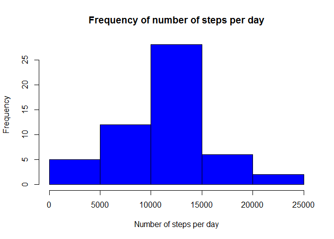
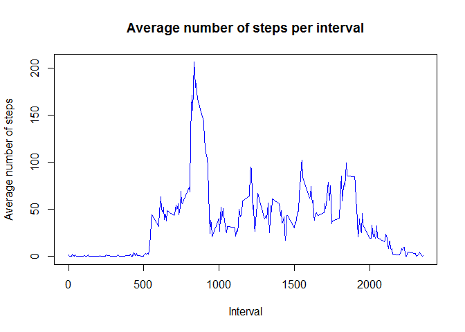
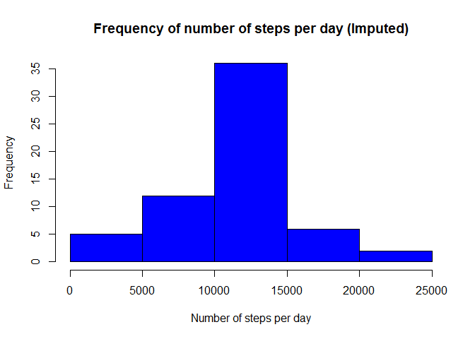
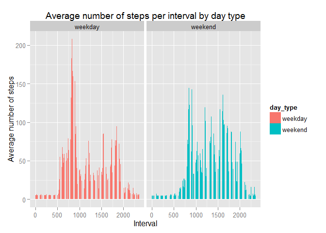

# Reproducible Research: Peer Assessment 1
<br />

### Loading and preprocessing the data
1. Load the data (i.e. `read.csv()`)

2. Process/transform the data (if necessary) into a format suitable for your 
analysis


```r
# load the data
data <- read.csv("activity.csv", header = TRUE)

# view activity data
head(data)
```

```
##   steps       date interval
## 1    NA 2012-10-01        0
## 2    NA 2012-10-01        5
## 3    NA 2012-10-01       10
## 4    NA 2012-10-01       15
## 5    NA 2012-10-01       20
## 6    NA 2012-10-01       25
```

<br />

### What is mean total number of steps taken per day?
For this part of the assignment, you can ignore the missing values in
the dataset.

1. Make a histogram of the total number of steps taken each day

2. Calculate and report the **mean** and **median** total number of steps taken 
per day


```r
# remove NA values
activity <- data[complete.cases(data),]

# aggregate steps as date to get total number of steps per day 
steps_per_day <- aggregate(steps ~ date, activity, sum)

# plot total number of steps per day
hist(steps_per_day$steps, 
     col = "blue",
     main = "Frequency of number of steps per day", 
     xlab = "Number of steps per day")
```

 

```r
# get mean total number of steps per day
mean(steps_per_day$steps)
```

```
## [1] 10766.19
```

```r
# get median total number of steps per day
median(steps_per_day$steps)
```

```
## [1] 10765
```

<br />

### What is the average daily activity pattern?
1. Make a time series plot (i.e. `type = "l"`) of the 5-minute interval (x-axis) 
and the average number of steps taken, averaged across all days (y-axis)

2. Which 5-minute interval, on average across all the days in the dataset, 
contains the maximum number of steps?


```r
# aggregate steps as interval to get the average number of steps averaged across 
# all days
steps_interval <- aggregate(steps ~ interval, activity, mean)

# plot average number of steps averaged across all days
plot(steps_interval$interval,
     steps_interval$steps,
     type = "l",
     col = "blue",
     main = "Average number of steps per interval",
     xlab = "Interval",
     ylab = "Average number of steps")
```

 

```r
# get maximum number of steps in interval 
max_steps <- max(steps_interval$steps)
max_steps
```

```
## [1] 206.1698
```

```r
# get which interval has maximum number of steps
steps_interval[steps_interval$steps == max_steps,]
```

```
##     interval    steps
## 104      835 206.1698
```

835 interval contains the maximum number of steps. 

<br />

### Imputing missing values
Note that there are a number of days/intervals where there are missing
values (coded as `NA`). The presence of missing days may introduce
bias into some calculations or summaries of the data.

1. Calculate and report the total number of missing values in the dataset (i.e. 
the total number of rows with `NA`s)

2. Devise a strategy for filling in all of the missing values in the dataset. 
The strategy does not need to be sophisticated. For example, you could use the 
mean/median for that day, or the mean for that 5-minute interval, etc.

3. Create a new dataset that is equal to the original dataset but with the 
missing data filled in.

4. Make a histogram of the total number of steps taken each day and Calculate 
and report the **mean** and **median** total number of steps taken per day. Do 
these values differ from the estimates from the first part of the assignment? 
What is the impact of imputing missing data on the estimates of the total daily 
number of steps?


```r
# calculate NA values
activity_na <- data[!complete.cases(data),]
nrow(activity_na)
```

```
## [1] 2304
```

```r
# get mean average number of steps averaged across all days in interval from 
# previous steps and use this number for imputing missing value
mean_interval <- mean(steps_interval$steps)

# create new dataset and update missing value with the mean value
activity_imputed <- data
activity_imputed[is.na(activity_imputed)] <- mean_interval

# aggregate steps as date to get total number of steps per day 
steps_per_day_imputed <- aggregate(steps ~ date, activity_imputed, sum)

# plot total number of steps per day
hist(steps_per_day_imputed$steps, 
     col = "blue",
     main = "Frequency of number of steps per day (Imputed)", 
     xlab = "Number of steps per day")
```

 

```r
# get mean total number of steps per day
mean(steps_per_day_imputed$steps)
```

```
## [1] 10766.19
```

```r
# get median total number of steps per day
median(steps_per_day_imputed$steps)
```

```
## [1] 10766.19
```

By imputing missing value, the median is differ from the first part of the
assignment. It shows a slightly increase in total number of steps per day.  

<br />

### Are there differences in activity patterns between weekdays and weekends?
For this part the `weekdays()` function may be of some help here. Use
the dataset with the filled-in missing values for this part.

1. Create a new factor variable in the dataset with two levels -- "weekday" and 
"weekend" indicating whether a given date is a weekday or weekend day.

1. Make a panel plot containing a time series plot (i.e. `type = "l"`) of the 
5-minute interval (x-axis) and the average number of steps taken, averaged 
across all weekday days or weekend days (y-axis).


```r
# create new dataset based of imputed dataset from previous step
activity_day_type <- activity_imputed

# create new columns for day and day type
activity_day_type$date <- as.Date(activity_day_type$date, "%Y-%m-%d")
activity_day_type$day <- weekdays(activity_day_type$date)
activity_day_type$day_type <- c("weekday") # initiate to weekday

# update Saturday and Sunday to weekend day type
activity_day_type[activity_day_type[,4] == "Saturday", 5] <- "weekend"
activity_day_type[activity_day_type[,4] == "Sunday", 5] <- "weekend"

# aggregate steps as interval to get the average number of steps averaged across 
# all weekday days or weekend days
steps_interval_day_type <- aggregate(steps ~ interval+day_type, 
                                     activity_day_type, 
                                     mean)

# plot average number of steps averaged across all weekday days and weekend days
library(ggplot2)
ggplot(steps_interval_day_type, aes(x = interval, y = steps, fill = day_type)) + 
   geom_bar(stat = "identity") + 
   facet_grid(.~day_type) +
   labs(x = "Interval", y = "Average number of steps") + 
   labs(title = "Average number of steps per interval by day type")
```

 
